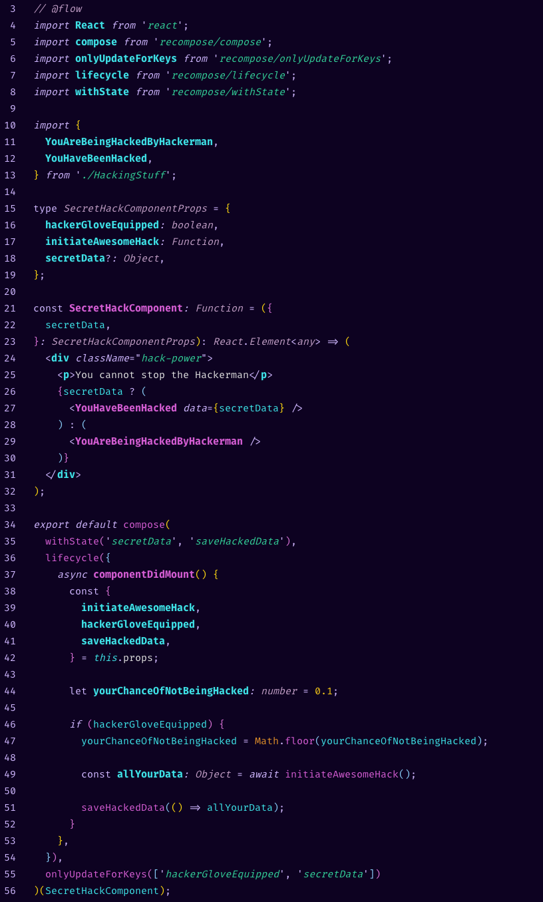
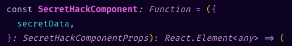

# SYNTHAX - dark theme for VS Code

WIP: Ride on the retro waves of future with this dark colorful theme for VS Code

This theme is still work in progress, and right now works only with **.js, .jsx and .json** files.

## Installing

1. **Using VS Code**

   In your VS Code, go to the extensions tab and search for **Synthax**, then click on Install and reload once the theme is installed.

2. **By cloning this repo**

   Clone this repo to your machine, and copy it's contents to the _vscode/extensions_ folder.

## Colors as clear representation of syntax

- Variables use a very prominent light blue-to-green color. Variable definitions are in bold, whereas variable calls / reassignments have no font style.  
  

- Functions & Classes use a bright pink color. Their definitions are in bold, whereas calls / reassignments have no font style.  
  

- Strings use green color  
  

- Numbers use yellow color  
  

- Booleans use pink color  
  

- Objects & object properties use variables color for the object identifier & white/respectice colors for object properties  
  

- Built-ins use orange-ish color  
  

- Types use very-light-purple color, all type definitions use the same color & font style  
  

- Tags are separated into 2 categories - native tags have variable color, React components have class color  
  

## Contributions are welcome

As this is a very early version, all contributions & comments are more than welcome!
